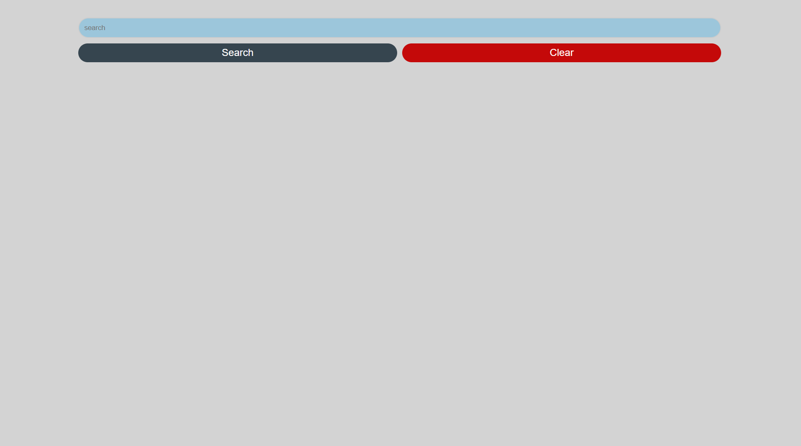
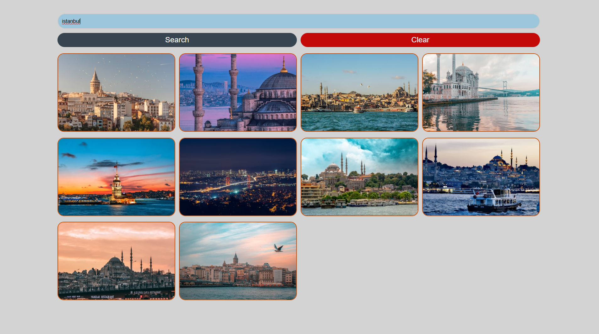

# 🖼️ Image Finder – Unsplash API App

A modern and interactive **Image Finder Application** built using **HTML, CSS, and JavaScript**, powered by the **Unsplash API**.

---

## 📌 Overview

Image Finder allows users to search and explore high-quality images by keyword with a clean and responsive interface:

- 🔍 **Image Search** – Search images by keyword  
- 🖼️ **Dynamic Results** – Instantly fetch images from Unsplash  
- 🧹 **Clear Results** – Remove all images with one click  
- ⚡ **Fast & Async** – Uses Fetch API for real-time data  
- 🎨 **Responsive UI** – Works smoothly on different screen sizes  

---

## 🛠️ Tech Stack

- **HTML5** 🌐  
- **CSS3** 🎨  
- **JavaScript (ES6+)** ⚡  
- **Unsplash REST API** 📸  

---

## ✨ Features

- 🌈 Clean and modern UI  
- 🔄 Real-time image fetching  
- 🧩 Beginner-friendly and readable code  
- 🚫 Error handling for empty searches  

---

## 🎥 Preview

  
  
